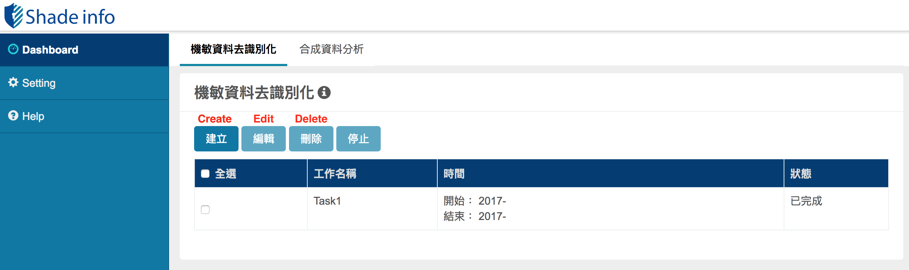
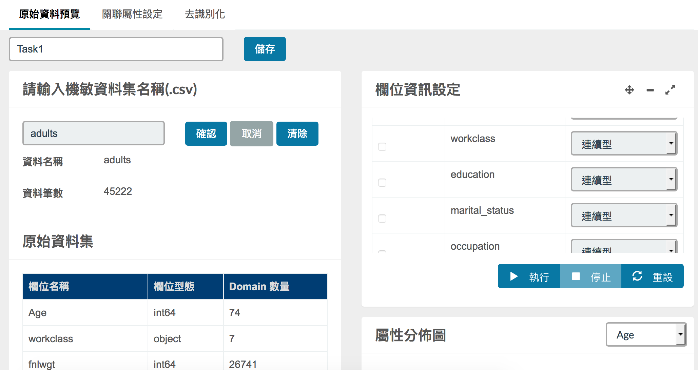
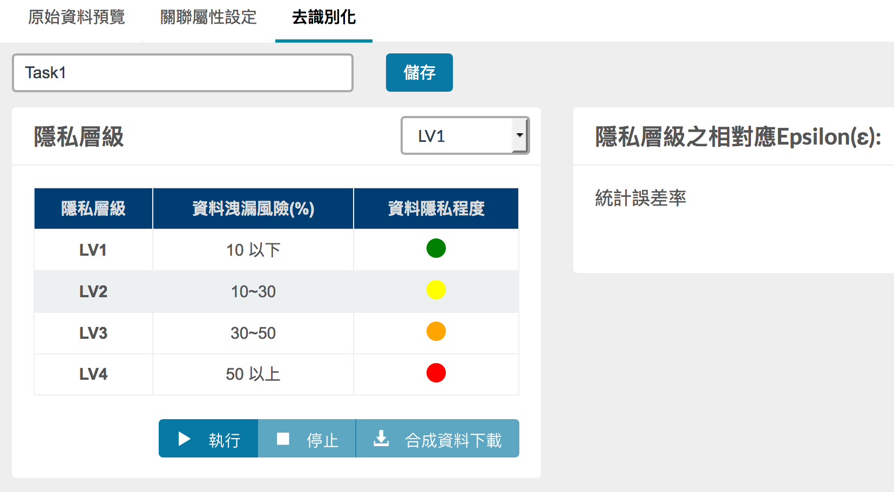

# De-identification Instruction

In this document, we introduce the main steps to generate the de-identified data. The steps are
* Create/Review/Delete de-identification jobs;
* Read data;
* Pre-processing;
* Generate de-identified data.

And we give you an example to demostrate the entire process of de-identication with the UCI Adult dataset.

**Note**:
1. Make sure you have go through the [starting tutorial](user_guide.md) and can visit to the dashboard correctly.
2. The original UCI Adult Dataset is incompelement without header and some missing values, we copied the original dataset, added the corresponding header and then remove some missing values. The manipulated version can be found [here](../static/test/adults.csv). 

## GUI overview
1. **Dashboard**
	
2. **Preview page**
	
3. **Generate sythetic data**
	

## Steps

### Create/Review/Delete de-identification jobs

### Read data

### Pre-processing

### Generate de-identified data

## Example