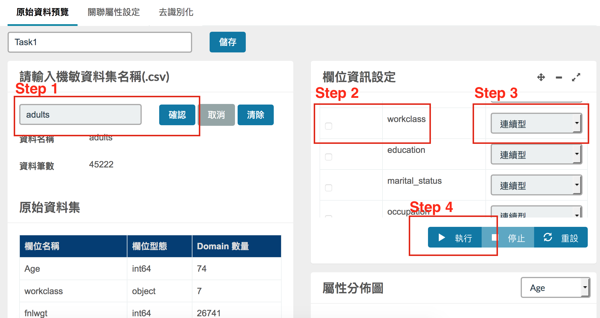
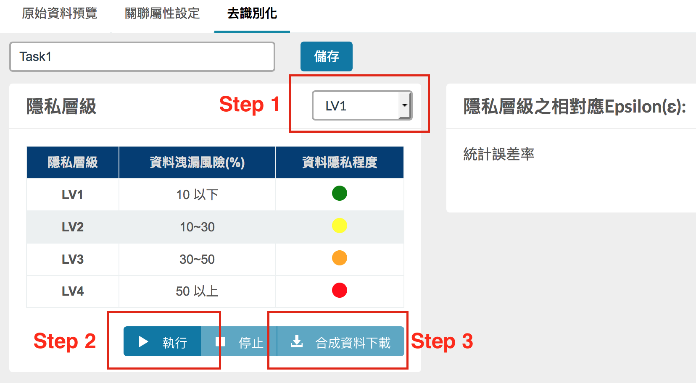

# De-identification Instruction

In this document, we introduce the main steps to generate the de-identified data. The steps are
* Create/Review/Delete de-identification jobs;
* Read data and Pre-processing;
* Generate de-identified data.

And we give you an example to demostrate the entire process of de-identication with the UCI Adult dataset.

**Note**:
1. Make sure you have go through the [starting tutorial](user_guide.md) and can visit to the dashboard correctly.
2. The original UCI Adult Dataset is incompelement without header and some missing values, we copied the original dataset, added the corresponding header and then remove some missing values. The manipulated version can be found [here](../static/test/adults.csv). 

## GUI overview
1. **Dashboard** 
	
2. **Preview page** 
	
3. **Generate sythetic data** 
	

## Usages

### Create/Review/Delete de-identification tasks

* The dashboard lists all the created de-identification tasks.
* **Create**: click to initiate a new de-identification task.
* **Review**: select a created task to view its details, can also modify the settings.
* **Delete**: select a created task to delete all the relative data.

### Read data and Pre-processing

1. Fill the textbox with file name and click confirm. For example, `adults` 
   **Note**: we now only support `.csv` file, make sure dataset in the directory is in `.csv` format.
2. Select the attributes will be included in the generated dataset.
3. For the selected attributes, specify the data type respect to the attribute. 
   **Example**: the `workclass` is categorical. Then for `workclass` change the numerical/continuous type to categorical in the drag-down list.
4. Click the button **Execute** to perform pre-processing.

### Generate de-identified data

After the **pre-processing** step, we can select the privacy level to generate de-identification dataset.

1. Select one privacy level from the drag-down list.
2. Click the **Execute** button to generate de-identification dataset.
3. When the *Step 2* is succeed, you can download the generated de-identification dataset.

## Example