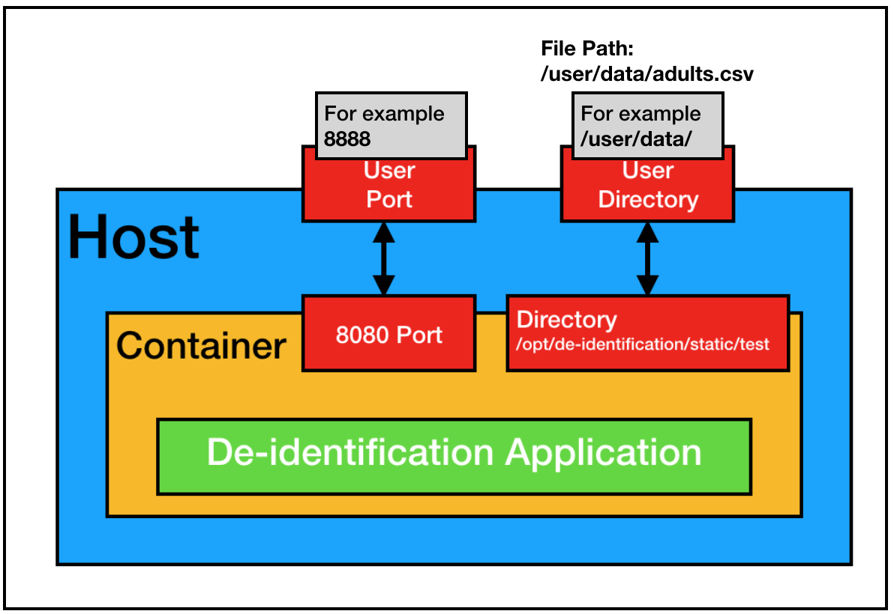
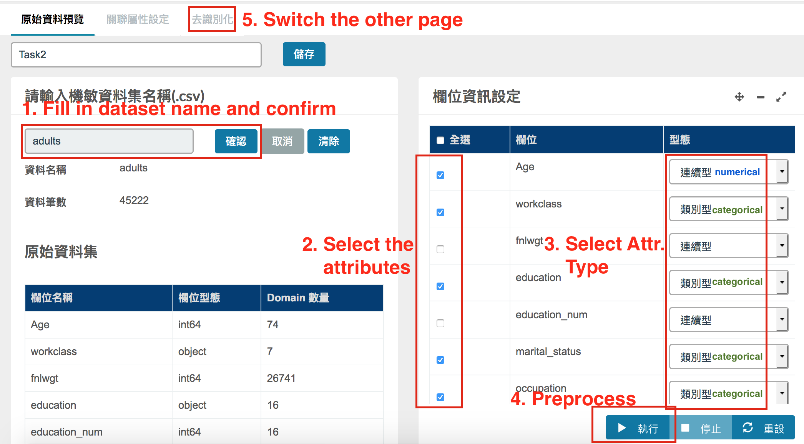

# De-identification Instruction

In this document, we introduce the main steps to generate the de-identified dataset. The steps are
* Create/Review/Delete de-identification jobs;
* Read data and Pre-processing;
* Generate de-identified data.

And we give you an example to demostrate the entire process of de-identication with the UCI Adult dataset.

**Note**:
1. Make sure you have go through the [starting tutorial](user_guide.md) and can visit to the dashboard correctly.
2. The original UCI Adult Dataset is incomplete, without header and some missing values, we copied the original dataset, added the corresponding header and then remove some missing values. The manipulated version can be found [here](../static/test/adults.csv). 

## GUI overview
1. **Dashboard**<br>
	
2. **Preview page**<br>
	
3. **Generate sythetic data**<br>
	

## Usages

### Create/Review/Delete de-identification tasks


* The dashboard lists all the created de-identification tasks.
* **Create**: click to initiate a new de-identification task.
* **Review**: select a created task to view its details, can also modify the settings.
* **Delete**: select a created task to delete all the relative data.

### Read data and Pre-processing


1. Fill the textbox with file name and click confirm. For example, `adults`<br>
   **Note**: we now only support `.csv` file, make sure dataset in the directory is in `.csv` format.
2. Select the attributes will be included in the generated dataset.
3. For the selected attributes, specify the data type respect to the attribute.<br>
   **Example**: the `workclass` is categorical. Then for `workclass` change the numerical/continuous type to categorical in the drag-down list.
4. Click the button **Execute** to perform pre-processing.

### Generate de-identified data


After the **pre-processing** step, we can select the privacy level to generate de-identification dataset.

1. Select one privacy level from the drag-down list.
2. Click the **Execute** button to generate de-identification dataset.
3. When the *Step 2* is succeed, you can download the generated de-identification dataset.

## Example

### 1. Download the dataset
We demostrate the proccess with dataset copied from UCI Adult Dataset, and add header to it. You can download the manipulated dataset [here](../static/test/adults.csv).
```
Age,workclass,fnlwgt,education,education_num,marital_status,occupation,relationship,race,sex,capital_gain,capital_loss,hours_per_week,native_country,salary_class
39,"State-gov",77516,"Bachelors",13,"Never-married","Adm-clerical","Not-in-family","White","Male",2174,0,40,"United-States","<=50K"
50,"Self-emp-not-inc",83311,"Bachelors",13,"Married-civ-spouse","Exec-managerial","Husband","White","Male",0,0,13,"United-States","<=50K"
38,"Private",215646,"HS-grad",9,"Divorced","Handlers-cleaners","Not-in-family","White","Male",0,0,40,"United-States","<=50K"
53,"Private",234721,"11th",7,"Married-civ-spouse","Handlers-cleaners","Husband","Black","Male",0,0,40,"United-States","<=50K"
28,"Private",338409,"Bachelors",13,"Married-civ-spouse","Prof-specialty","Wife","Black","Female",0,0,40,"Cuba","<=50K"
37,"Private",284582,"Masters",14,"Married-civ-spouse","Exec-managerial","Wife","White","Female",0,0,40,"United-States","<=50K"
...
```

### 2. Place the dataset on host
Suppose your attach the directory `/user/data/` into the Docker container, then put the downloaded dataset `adults.csv` under `/user/data` on the host machine, and the full path of dataset should be `/user/data/adults.csv` on host machine. The following figure shows a inituition.


### 3. Visit dashboard
Suppose the Docker container is launched successfully, you can visit the dashboard via web browser. For example, if the IP address of host machine is 140.112.42.26 and the Docker container is listening to the 8888 port, then visit the deshboard via the URL, http://140.112.42.26:8888.

### 4. Data preview and preprocessing


### 5. Generate de-identified data.


After the **pre-processing** step, we can select the privacy level to generate de-identification dataset.

1. Select one privacy level from the drag-down list.
2. Click the **Execute** button to generate de-identification dataset.
3. When the *Step 2* is succeed, you can download the generated de-identification dataset.